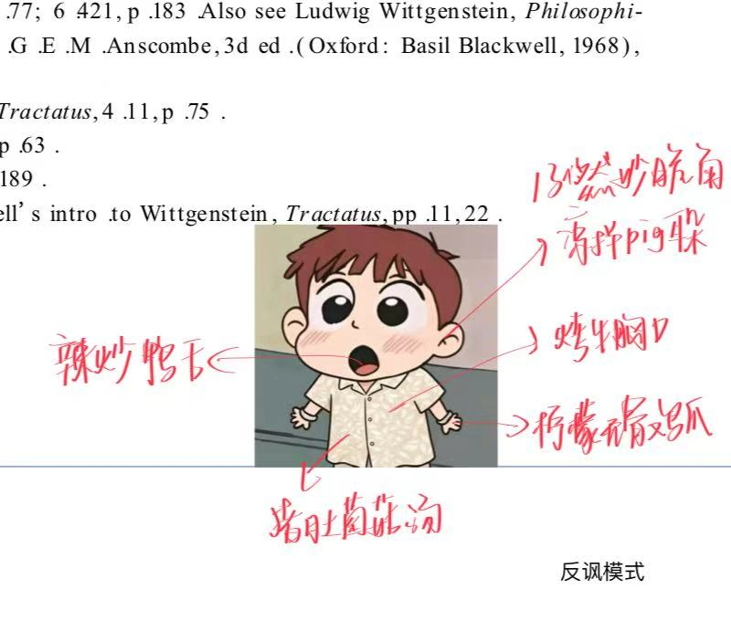
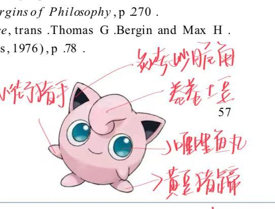
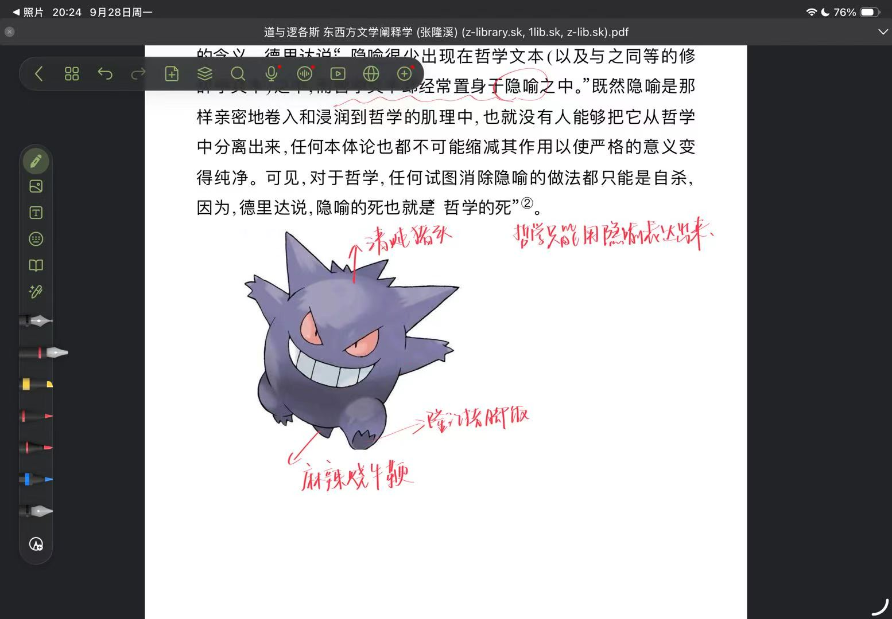

# 🖍️ 头像菜单局 · Menu My Avatar

**把你的头像贴进一页学术书页，让「红笔批注老师」把你的每个部位都认成一道菜。**

一个可以直接喂给 ChatGPT / Claude 的 AI 提示词技能：上传一张头像，几秒钟后收获一张"红笔箭头 + 手写菜名"的整活书页梗图——手是卤猪蹄，脸是糯米团子，卷发是海苔卷。

[](LICENSE)


---

## 效果参考（灵感风格）

以下三张图是本技能追求复刻的**版式与手写批注风格**，来自 [`annotate-avatar-in-red/assets/`](annotate-avatar-in-red/assets)：

<p align="center">
  
  
  
</p>

> 这三张是"要达到什么效果"的灵感参考图，不是本技能的实际生成结果。**强烈建议你用自己的头像跑一遍、把真实生成效果截图替换到这里**——真实的"我的头像变成菜单"对比图，传播效果远好于风格参考图。

## 这是什么 / 怎么玩

核心笑点只有一条：**红笔箭头把头像的某个部位认成一道具体的菜**，而不是泛泛的夸奖、性格分析或学术吐槽。

- 支持卡通头像、动漫形象、宠物/动物头像、真人头像
- 输出是一整张"书页照片"：泛黄纸张、几行不需要可读的学术文字、头像像贴纸一样贴在中间偏下、四周是 4–6 条潦草红笔手写箭头 + 食物名
- 真人头像不会被偷换成动漫角色，五官保持原样，只是批注文字在"乱认菜"

## 🚀 一键开始：把这段话复制进 GPT 里

打开任意支持看图 + 生成图片的 ChatGPT 对话（GPT-4o 或更新），复制下面这一整段发送，**并附上你的头像图片**：

```text
你是一个「红笔批注老师」。我会发给你一张头像图片。请你以这张头像为主角，生成一张完整图片，效果如下：

【画面设定】一页泛黄/米白色的学术书页或论文页面，背景隐约有几行原创的、不需要完全可读的学术文字（中英文均可，自然选择即可）。头像像贴纸一样贴在书页中央偏下的位置，占画面宽度的 35%–55%，尽量保持头像本身的识别特征（不要换脸、不要改变原本的风格或形象）。

【核心玩法】围绕头像用鲜红手写体标注 4–6 个箭头，每个箭头精确指向头像上一个可见的部位（比如手、脸颊、头发、衣服颜色等），箭头旁用潦草的红笔手写字体写下"这个部位像什么食物"的联想——必须是具体的菜名/零食/食材名称（例如"卤猪蹄""糯米团子""蜜桃大福""海苔卷"），不能写抽象的夸奖、性格分析或无关的句子。字迹要有笔画粗细和倾斜变化，不要用整齐的印刷体。看不见的部位不要强行标注。

【生成前】请先列出你打算写的 4–6 条食物批注文字和对应部位，确认这些部位都是头像里真实能看到的，我确认没问题后你再生成图片；如果我没有异议就直接按此生成。

【禁止事项】不要照抄任何截图界面/工具栏，不要加水印、二维码或多余的人物/logo，不要把头像本体真的改造成食物（只是批注文字在"乱认"）。

我的头像如下：
[在这里发送你的头像图片]
```

觉得效果不满意？直接在对话里继续说"箭头再密一点""换成中文论文风格"之类的话，模型会在原图基础上调整。

## 进阶：作为 Claude Skill 安装

如果你用的是支持 Skills 的 Claude / Claude Code：

1. 把 [`annotate-avatar-in-red/`](annotate-avatar-in-red) 整个文件夹拷贝到你的 skills 目录（例如 `~/.claude/skills/`）
2. 在对话里上传头像并说"用红笔批注头像技能"即可触发
3. 完整的规则、提示词骨架都写在 [`annotate-avatar-in-red/SKILL.md`](annotate-avatar-in-red/SKILL.md) 里，可以直接改成自己喜欢的联想风格（比如把"食物"换成"星座""网络热梗"等）

## 目录结构

```
annotate-avatar-in-red/
├── SKILL.md            # 核心规则 + 可复用提示词骨架
├── agents/openai.yaml  # OpenAI 侧的 agent 配置
└── assets/              # 风格参考图（reference-01/02/03.jpg）+ 图标
```

## FAQ

**支持什么样的头像？**
卡通、动漫、游戏角色、宠物、真人头像都可以，只要主体清晰可辨认。

**生成的汉字乱码/写错字怎么办？**
在对话里指出具体哪条批注错了，让模型针对该文字区域重新生成一次；如果反复出错，换成更短、更常见的菜名通常能解决。

**可以商用吗？**
代码/提示词部分以 [MIT License](LICENSE) 开源，可自由使用和修改；但生成结果中涉及的他人头像，使用前请确保你有权处理该头像。

**能不能把"食物"换成别的梗？**
可以，`SKILL.md` 里的规则和提示词骨架都是纯文本，直接改联想类别（星座、动物、网络热梗……）就能派生出新玩法。

## 贡献

欢迎提 Issue / PR，尤其欢迎：

- 补充你自己生成的真实效果图（替换上面的风格参考图）
- 适配其他平台（Gemini、豆包等）的对应 prompt
- 多语言版本的批注风格

## License

[MIT](LICENSE) © 2026 1368470655@qq.com
